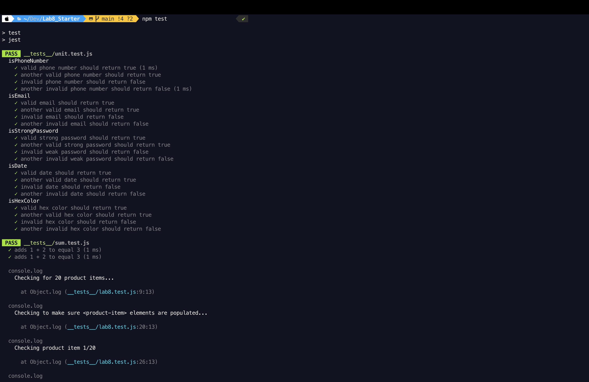
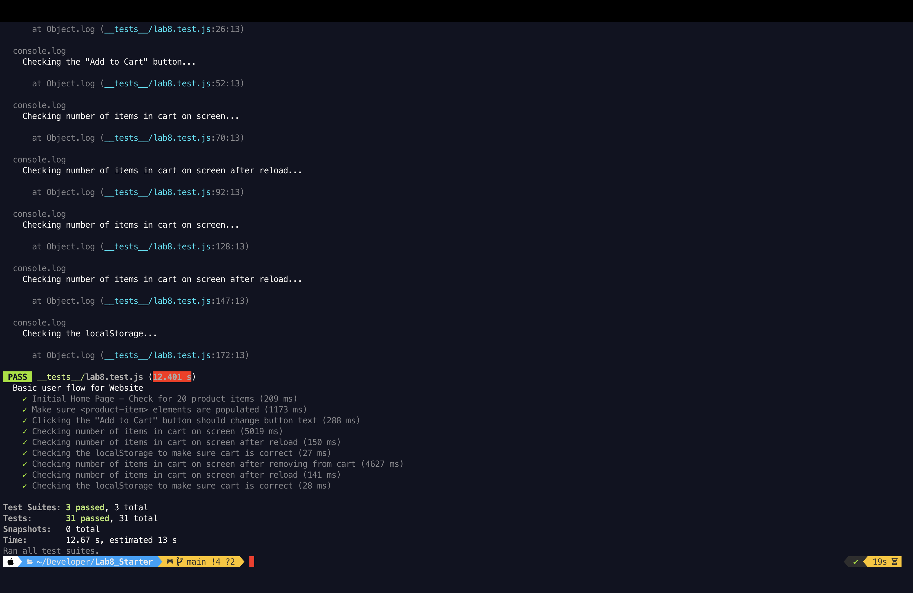

# Lab 8 - Starter

__1. Where would you fit your automated tests in your Recipe project development pipeline? Select one of the following and explain why.__

Automated tests should be incorporated within a GitHub action that runs whenever code is pushed. This approach, known as continuous integration (CI), provides early feedback, ensures integration with existing code, supports collaboration and code review, and offers scalability and efficiency benefits. Manual testing before pushing code or running tests after development is completed is not as effective in catching issues early and maintaining code integrity.

__2. Would you use an end to end test to check if a function is returning the correct output? (yes/no)__

No

__3. Would you use a unit test to test the “message” feature of a messaging application? Why or why not? For this question, assume the “message” feature allows a user to write and send a message to another user.__

The "message" feature of a messaging application should not be tested using unit tests due to its large-scale nature and the involvement of multiple interacting components. Instead, it is more appropriate to use end-to-end tests for this feature. End-to-end tests simulate the entire user journey from start to finish, providing a comprehensive evaluation of the feature's functionality by emulating real user actions. These tests verify the complete process of writing and sending a message, ensuring that all components and interactions work correctly.

__4. Would you use a unit test to test the “max message length” feature of a messaging application? Why or why not? For this question, assume the “max message length” feature prevents the user from typing more than 80 characters.__

Yes, unit testing is suitable for this small-scale feature since it allows for independent testing without the need to evaluate the interactions of multiple components.

### Tests screenshots

